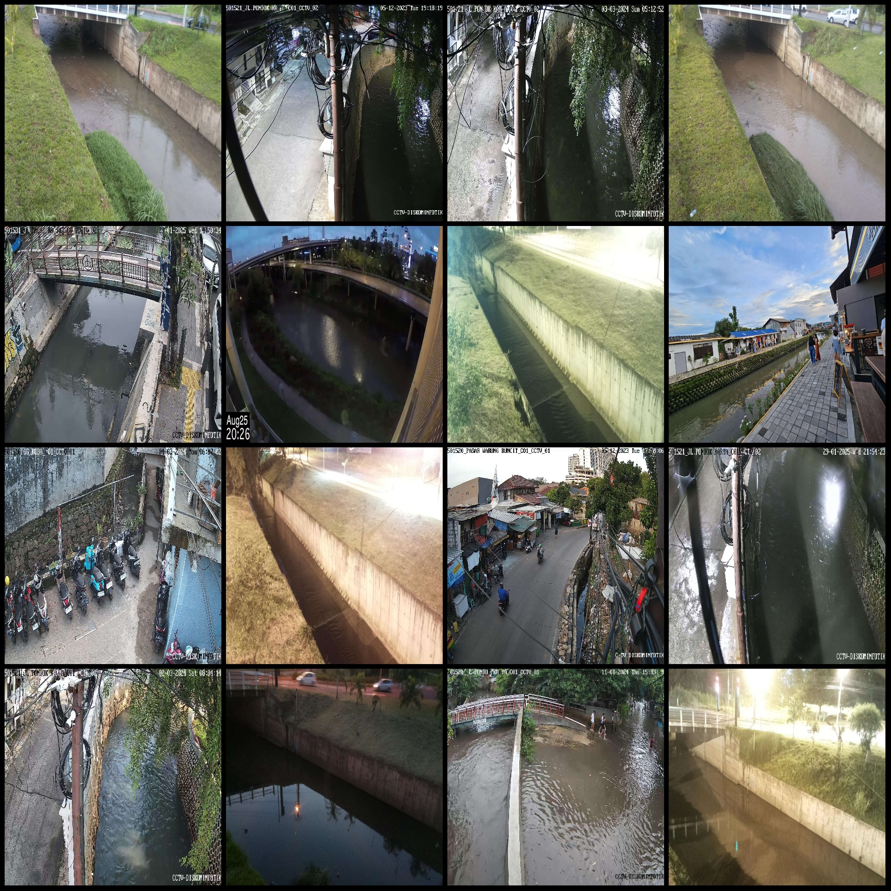
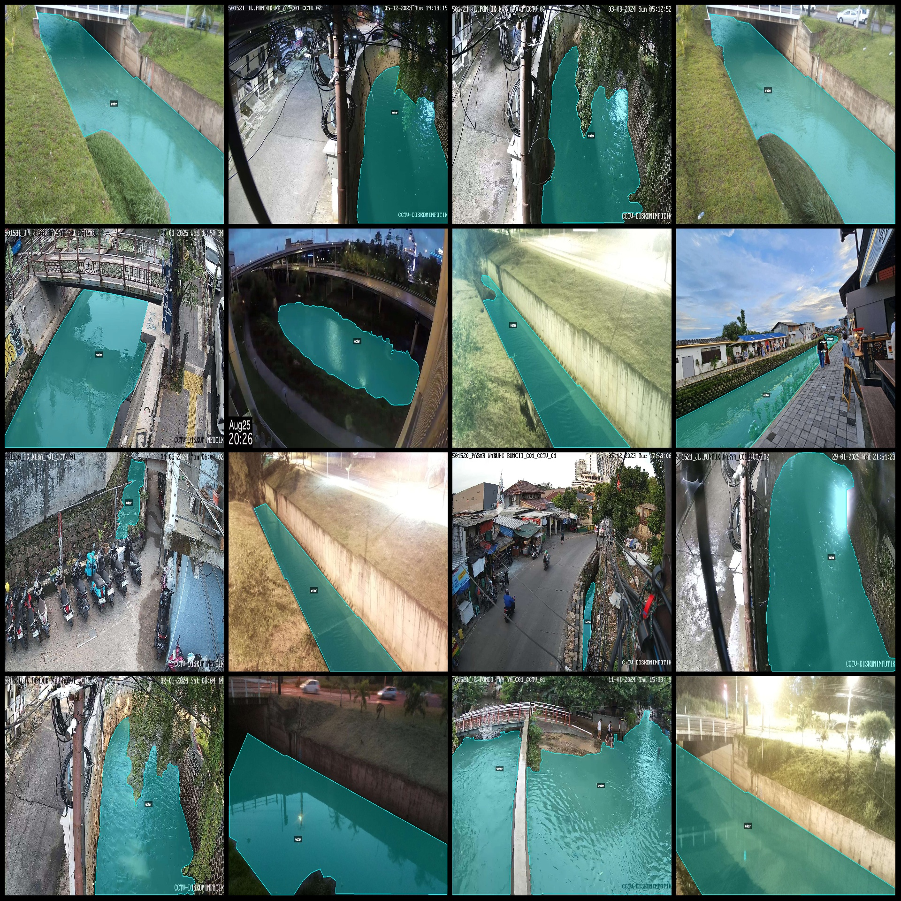
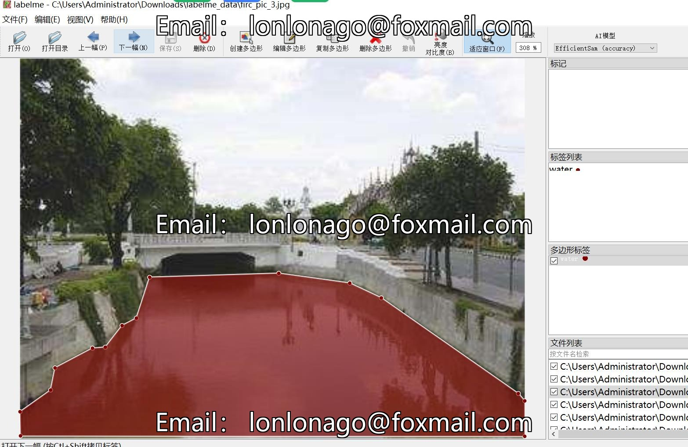
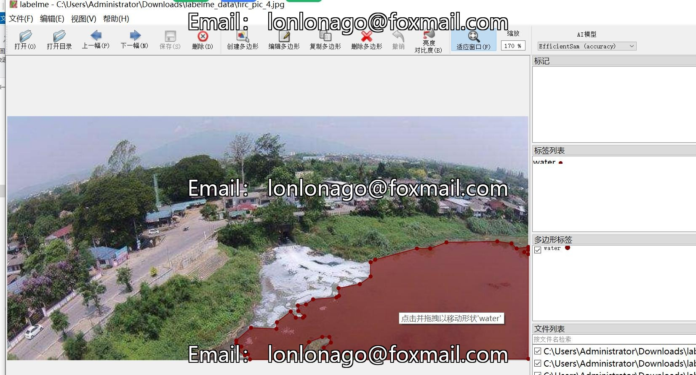

# Drone Viewpoint Aerial Photography River Inspection Water Area Segmentation Dataset in LabelMe Format with 2758 Images and One Category

Dataset format: LabelMe format (excluding mask files, only containing jpg images and corresponding json files)
Number of images (number of jpg files): 2758
Number of annotations (json file number): 2758
Number of annotation categories: 1
Annotation category name: "water"
Number of boxes per category: 3991
Total boxes: 3991
Annotation tool used: labelme=5.5.0
Image resolutions: Multi-resolution images, such as 1920x1080, 1920x1440, etc.
Annotation rules: Polygon box is drawn for each category
Important note: The dataset can be edited using LabelMe, but the json dataset needs to be converted into a mask or Yolo format or COCO format for semantic segmentation or instance segmentation.
Special declaration: This dataset does not guarantee the accuracy of the trained model or weight files.
Image preview:
Annotation example:
Randomly selected 16 images:
Annotation drawing results:
LabelMe editing image example:

## Image

Here is a pay link on Stripe ( https://buy.stripe.com/3cs8yP7sY87d0vu9AB ). Please contact me lonlonago@foxmail.com after funding $89, and I will send you a complete data files , thank you!

